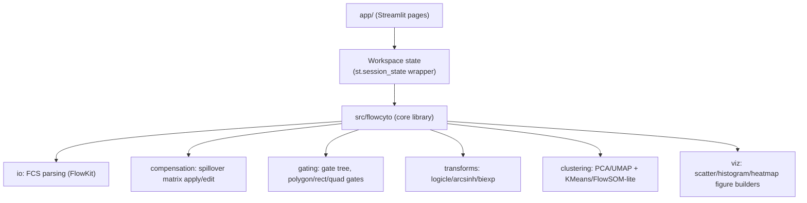

# Architecture

## Goal

A Streamlit web app for flow cytometry analysis: load `.fcs` files, compensate,
gate populations interactively, transform channels, and run unsupervised
clustering/dimensionality reduction to help identify populations.

## Deployment target & constraints

Streamlit Community Cloud (free tier):

- ~1 GB RAM per app, shared CPU, app sleeps after inactivity.
- No durable filesystem — anything not in `st.session_state` disappears on
  rerun/restart. This repo's v1 is **session-only**: users re-upload `.fcs`
  files each visit; nothing is persisted server-side.
- Single process — no background workers/queues. Long-running steps
  (clustering, UMAP) must stay within the free tier's memory/CPU budget, so
  v1 should cap sample size (e.g. subsample events above a threshold before
  UMAP/clustering) rather than assume unlimited compute.

## Layers



- **`app/`** — Streamlit UI only. Each page renders widgets, reads/writes the
  `Workspace` object in `st.session_state`, and calls into `src/flowcyto` for
  any real computation. Pages contain no analysis logic themselves.
- **`src/flowcyto/`** — installable core library, framework-agnostic (no
  Streamlit imports). This is what makes the logic testable with `pytest`
  and reusable outside the app (scripts, notebooks) later.
- **State (`state.py`)** — a single `Workspace` dataclass held in
  `st.session_state` holding: loaded `Sample`(s), the active compensation
  matrix, the gating strategy/tree, applied transforms, and the last
  clustering result. Pages mutate this object; nothing else holds app state.

## Module responsibilities (`src/flowcyto/`)

| Module | Responsibility | Key library |
|---|---|---|
| `io` | Read `.fcs` (2.0/3.0/3.1), expose metadata + event DataFrame | FlowKit / `flowio` |
| `compensation` | Load/edit spillover matrix, apply/undo compensation | FlowKit |
| `gating` | Build gate hierarchy (rect/polygon/quadrant), apply to events | FlowKit (GatingML-compatible) |
| `transforms` | Logicle/arcsinh/biexponential channel transforms | FlowKit |
| `clustering` | Dimensionality reduction (PCA/UMAP) + clustering (KMeans first; FlowSOM-like later) | scikit-learn, umap-learn |
| `viz` | Build Plotly figures (scatter, histogram, gate overlay, heatmap) from a Sample/result | Plotly |

## Data flow

```
Upload .fcs → io.parse → Sample (metadata + raw DataFrame)
  → compensation.apply (spillover matrix from file or user-edited)
  → transforms.apply (per-channel, e.g. logicle)
  → gating.apply (interactive gates → boolean masks / gated subsets)
  → clustering.run (subsample if needed → PCA/UMAP → KMeans) [optional branch]
  → viz.* renders at every stage
  → export: download gated data / figures / gating strategy as files
    (no server-side persistence — see constraints above)
```

## Phased roadmap (de-risking the full v1 scope)

1. **Parse & view** — upload `.fcs`, show metadata + channel list, raw
   scatter/histogram. Proves FlowKit parsing + Streamlit plumbing works.
2. **Compensate & gate** — apply/edit spillover matrix; interactive
   rectangle/polygon gating with a visible gate tree.
3. **Transform & cluster** — logicle/arcsinh transform UI; PCA/UMAP +
   KMeans on (sub)sampled gated events, colored scatter of resulting
   clusters.

Each phase is a working, demoable app on its own — later phases build on
earlier ones, not replace them.

## Testing

- `tests/` uses `pytest`. `tests/fixtures/` holds small sample `.fcs` files
  (a few thousand events) checked into the repo for fast, offline tests.
- Core library (`src/flowcyto`) is unit-tested directly, without Streamlit.
- UI pages are smoke-tested manually (and optionally with
  `streamlit`'s `AppTest` harness later) — not a v1 priority.

## Tech stack

- **UI**: Streamlit (multipage app)
- **FCS parsing / gating / compensation / transforms**: FlowKit
- **Numerics**: pandas, numpy
- **Clustering / dim-reduction**: scikit-learn, umap-learn
- **Plotting**: Plotly (interactive, works well embedded in Streamlit)
- **Testing**: pytest
